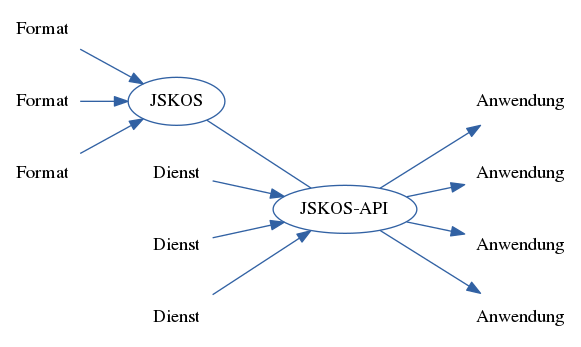
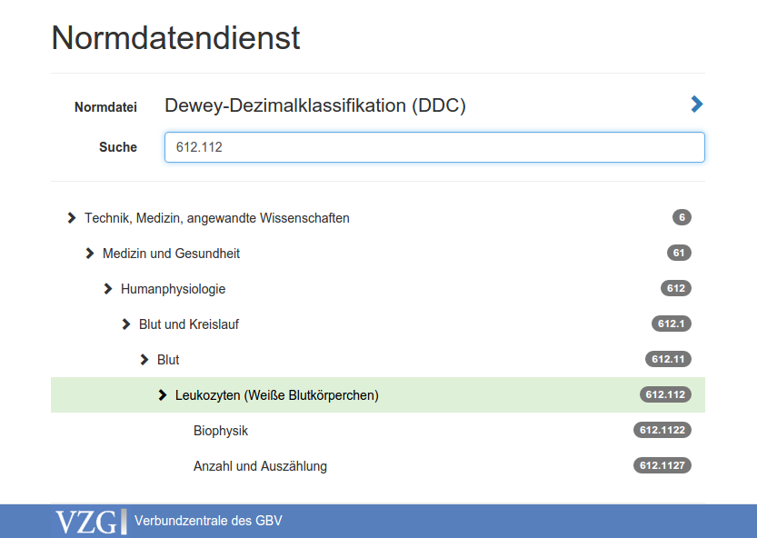
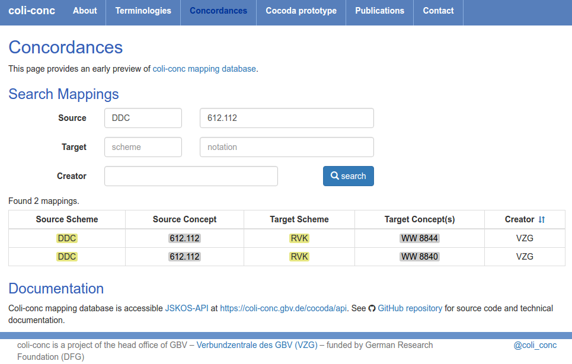

---
title: Einheitliche Normdatendienste der VZG
subtitle: Entwicklungsstand & Planungen
author: 
  - name: Jakob Voß
date: 2016-06-01
place: Verbundzentrale des GBV (VZG)
...

# Grundlagen

## Begriffsklärung 

Normdaten
  : System aus Begriffen zur Wissensorganisation

Dienst
  : Technische Einheit, die zusammenhängende Funktionalität über eine klar
    definierte Schnittstelle (API) zur Verfügung stellt

Dienstleistung
  : Erbringung einer immateriellen Leistung\
    zur Deckung eines Bedarfs

## Normdaten basieren auf identifizierten Begriffen

Benennung            Identifier (hier: GND-/Wikidata-URIs)
-------------------- ---------------------------------------------------
Dienst (Informatik)  <http://d-nb.info/gnd/4835035-7>
Dienst (Architektur) <http://www.wikidata.org/entity/Q498386>
Dienst (Schiffahrt)  <http://www.wikidata.org/entity/Q1220858>
...                  ...
Dienstleistung       <http://d-nb.info/gnd/4012178-1>
Dienstleistung       <http://www.wikidata.org/entity/Q7406919>
...                  ...
Normdatei            <http://d-nb.info/gnd/4239774-1>
Normdatei            <http://www.wikidata.org/entity/Q36524>
Normdaten            $\Rightarrow$ <http://www.wikidata.org/entity/Q36524>
-------------------- ---------------------------------------------------

## Beispiel: Gemeinsame Normdatei (GND)

* Zentrale Verwaltung durch die DNB
* Pflege durch Mitglieder (u.A. GBV-Bibliotheken)
* Verschiedene (mehr oder weniger) Dienste zum Zugriff
    * Laufende Updates (MARC21?)
    * Linked Open Data
    * RDF-Dump
    * Web-Interfaces (z.B. <http://gnd.eurospider.com/>)
    * ...

## Einige Arten von ~~Normdaten~~ Wissensorganisationssystemen

**Klassifikationen**\
(z.B. Regensburger Verbundklassifikation, RVK)

**Normdateien**\
(z.B. Gemeinsame Normdatei, GND)

**Thesauri**\
(z.B. Standard-Thesaurus Wirtschaft, STW)

## Viele Arten von Wissensorganisationssystemen

* Lokale Bibliotheksystematiken
* Fachspezifische Vokabulare
* Museumsvokabulare
* Einfache Listen von Klassen/Typen
* ...

Systematik von Knowledge Organization Systems (KOS):
<https://angryloki.github.io/wikidata-graph-builder/?property=P279&item=Q6423319&lang=de&mode=reverse>

## Viele Datenformate für Wissensorganisationssysteme

* MARC 21 for 
  [Authority](https://www.loc.gov/marc/authority/)/[Classification](https://www.loc.gov/marc/classification/) Data
* [Metadata and Authority Description Schema (MADS)](https://www.loc.gov/standards/mads/)
* [ISO 25964 XML](http://www.niso.org/schemas/iso25964/schema-intro/)
* Classification Markup Language (ClaML)
* [Vocabulary Definition Exchange (VDEX)](https://www.imsglobal.org/vdex/)
* **[Simple Knowledge Organization System (SKOS)](https://www.w3.org/2004/02/skos/)**

Realität:

* Excel, CSV...
* Word, PDF...

Lösung:

* Noch ein weiterer Standard ($\Rightarrow$ JSKOS)

# Einheitliche Normdatendienste der VZG

## Motivation

1. Konsolidierung von Normdaten innerhalb der VZG

    $\Rightarrow$ vor allem im Bereich Digitaler Bibliotheken 
     ([kuniweb-Museumserfassung](https://kuniweb.gbv.de/),
      [kenom-Münzportal](http://www.kenom.de/))

Gemeinsame Normdatei, GeoNames, Bayerische Oberbegriffsdatei, Hessische
Systematik, Ortsangaben des Bundesamtes für Kartographie und Geodäsie, Arts &
Architecture Thesarus, Online Coins of the Roman Empire, Coinage of the Roman
Republic Online... 

## Motivation

2. Mapping zwischen Normdateien

    $\Rightarrow$ [DFG-Projekt coli-conc](https://coli-conc.gbv.de/)

"Es wird für wünschenswert erklärt, *daß die bestehenden und künftigen
Klassifikationssysteme durch ein gemeinsames Hilfsmittel untereinander in
Beziehung gesetzt und daß Konkordanzen zwischen den angewandten Systemen und
dem Hilfssystem hergestellt werden.*"

--- Paul Schwenke 1910 über den *Kongress für Bibliographie und
Dokumentation* unter der Leitung von Lafontaine und Otlet

## Projekt coli-conc

> Entwicklung einer Infrastruktur für den Austausch, die Erstellung, und die
> Wartung von Konkordanzen zwischen bibliothekarischen
> Wissensorganisationssystemen

DFG-Förderung 12/2015-12/2017 

* Uma Balakrishnan, Jakob Voß, Jana Maria Agne,\
  Morsheda Akter, Moritz Horn

<https://coli-conc.gbv.de/>

## Normdatendienste

* Bereitstellungen von Diensten zum\
  **einheitlichen Zugriff auf Normdaten**

    * Zugriff auf Normdatensatz
    * Suche nach Normdatensätzen
    * Bearbeitung von Normdatensätzen
    * ...

## Normdatendienste aus dem deutschsprachigen Bibliothekswesen

* [Web Services for Economics (ZBW)](http://zbw.eu/en/project/econ-ws)
* [lobid-API (hbz)](https://lobid.org/api)
* [Entity Facts (DNB)](http://www.dnb.de/entityfacts)

## Weitere Beispiele für Normdatendienste

### Internationales Bibliothekswesen

* [finto: Finnish thesaurus and ontology service](https://finto.fi/en/)
* [Library of Congress Linked Data Service](http://id.loc.gov/)

### Blick über den Tellerrand

* [Wikidata](https://www.wikidata.org/) (indirekt)

* [Vocabulary Services Interest Group](https://rd-alliance.org/groups/interest-groups)\
der [Research Data Alliance (RDA)](https://rd-alliance.org/)

## Normdatendienste an der VZG

* Interne Bereitstellung von Normdaten\
  für unsere Anwendungen (Portale, Projekte...)
* Externe Bereitstellung von Normdaten\
  für unsere Mitglieder und die Öffentlichkeit
* Vokabularserver zur Pflege und Bereitstellung\
  von (Museums)vokabularen durch Externe

# Stand und Planung

## Sammlung und Erschließung von KOS

 (erst seit Ende 2013) erfasst bereits über 1.800 Systeme](bartoc-logo.png)

<!--
Wikidata enthält [mehr 8.000 KOS](http://tinyurl.com/j62lwro), davon [250 Klassifikationen](http://tinyurl.com/jxhop3b)-
(incl. einige Fälle von Konzepten z.B. Sterntype!)
-->

Ledl, Andreas and Voss, Jakob: *Describing Knowledge Organization Systems in
BARTOC and JSKOS.* International Conference on Terminology and Knowledge
Engineering (TKE2016) <http://hdl.handle.net/10760/29366>

## JSKOS, ein einheitliches Datenformat für Normdaten

* basiert auf RDF (SKOS & Dublin Core)\
  \ldots aber etwas stärker vereinheitlicht
* basiert auf JSON-LD\
  \ldots aber etwas vereinfacht und erweitert

Hauptziel: **einfache Nutzung in Webanwendungen**

Spezifkation unter <https://gbv.github.io/jskos/>

## JSKOS Beispiel: Geonames Eintrag (gekürzt)

~~~json
{
  "uri": "http://sws.geonames.org/614540/",
  "prefLabel": {
    "en": "Georgia", 
    "fr": "Géorgie", 
    "de": "Georgien", 
    "-": "..."
  },
  "broader": [ 
    { "uri": "http://sws.geonames.org/6255147/" } 
  ],
  "inScheme": [ 
    { "uri": "http://bartoc.org/en/node/15" }
  ],
  ...
~~~

## Umsetzung: JSKOS & JSKOS-API

JSKOS
  : Einheitliches Datenformat for Normdaten,\
    basierend auf JSON-LD und SKOS

JSKOS-API
  : Webservice-Spezifikation\
    zum Zugriff auf Normdaten

`http://example.org/` **`?search=Normdaten`**

~~~json
{
  "prefLabel": { "de": "Normdatei" },
  "altLabel": { "de": [ "Normdaten" ] },
  "uri": "http://d-nb.info/gnd/4239774-1",
  "inScheme": [ "bartoc.org/en/node/430" ]
}
~~~

## Konvertierung und Bereitstellung 

Einheitliche Verarbeitung von Normdaten in (Web)anwendungen

## Einheitlicher Browsing-Zugriff auf Normdaten

## Mapping Datenbank

## Beispiel eines Mappings in JSKOS

~~~json
{
  "creator": { "notation": [ "VZG" ] },
  "fromScheme": {
     "uri": "http://bartoc.org/en/node/241",
     "notation": [ "DDC" ]
  },
  "from": { "members" : [
    { "uri:": "http://dewey.info/class/612.112" }
  ] },
  "toScheme" : {
     "uri": "http://bartoc.org/en/node/533",
     "notation": [ "RVK" ]
  },
  "to": { "members" : [
    { "uri": "http://uri.gbv.de/terminology/rvk/WW8844" }
  ] }
}
~~~

## Stand der JSKOS-API

* [Entity Lookup Microservice API (ELMA)](http://gbv.github.io/elma/)\
  als Teilmenge der wichtigsten Anwendungsfälle

    entity lookup
      : `?uri=http://sws.geonames.org/614540/`

    entity search
      : `?search=Normdatei`

* public demo of terminology wrappers: 
  <https://jskos-php-examples.herokuapp.com/>\
  (BARTOC, Wikidata, GND, ORCID, GeoNames, VIAF \ldots)

* Implementierung als Open Source: [jskos-php](https://github.com/gbv/jskos-php)
 
## Zusammenfassung

* Einheitlicher Zugriff auf verschiedenste Normdaten
    * Konsolidierung von Normdaten innerhalb der VZG
    * Mapping zwischen Normdateien
    * ...
* Datenformat: JSKOS
* API zum Zugriff: ELMA ($\subset$ JSKOS-API)
* Bisher kein produktiver Dienst der VZG (kommt aber)

## Weitere Informationen

Veröffentlichungen im Rahmen des **DFG-Projekt coli-conc**

<https://coli-conc.gbv.de/publications/>

* Projektberichte
* JSKOS-Spezifikation
  ([JSKOS](https://gbv.github.io/jskos/), 
   [ELMA](https://gbv.github.io/elma/)...)
* JSKOS-Programmbibliotheken 
  ([jskos-php](https://packagist.org/packages/gbv/jskos)...)
* JSKOS-Anwendungen
  ([jskos-php-examples](http://jskos-php-examples.herokuapp.com),
   [cocoda-db](https://github.com/gbv/cocoda-db)...)

## Nachtrag: Begriffsklärung Normdatendienste

Normdatendienst (Normen)
  : EDIFACT-Normdatendienst der DIN

Normdatendienst (Normdaten)
  : im Sinne dieses Vortrags

> Mag jemand "Normdatendienst" in der GND anlegen?
