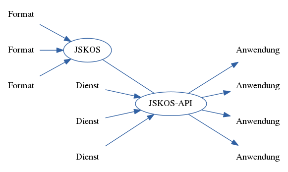

---
title: Einheitliche Normdatendienste der VZG
author: Jakob Voß, Tobias Helms
date: 2016-03-14
place: Bibliothekskongress, Leipzig
institute: Verbundzentrale des GBV (VZG)
...

# Grundlagen

## Begriffsklärung 

Normdaten
  : System aus Begriffen zur Wissensorganisation

Dienst
  : Technische Einheit, die zusammenhängende Funktionalität über eine klar
    definierte Schnittstelle zur Verfügung stellt

## Normdaten basieren auf Begriffsklärungen

Benennung            Identifier (hier: GND- und Wikidata-URIs)
-------------------- ---------------------------------------------------
Dienst (Informatik)  <http://d-nb.info/gnd/4835035-7>
Dienst (Architektur) <http://www.wikidata.org/entity/Q498386>
Dienst (Schiffahrt)  <http://www.wikidata.org/entity/Q1220858>
...                  ...
Normdatei            <http://d-nb.info/gnd/4239774-1>
Normdaten            -- ($\Rightarrow$ <http://d-nb.info/gnd/4239774-1>)
...                  ...
-------------------- ---------------------------------------------------

## Arten von ~~Normdaten~~ Wissensorganisationssystemen

**Klassifikationen**\
(z.B. Regensburger Verbundklassifikation, RVK)

**Normdateien**\
(z.B. Gemeinsame Normdatei, GND)

**Thesauri**\
(z.B. Standard-Thesaurus Wirtschaft, STW)

## Viele Wissensorganisationssysteme

* Lokale Bibliotheksystematiken
* Fachspezifische Vokabulare
* Listen von Klassen/Typen
* Bestandteil von Forschungsdaten
* ...

 (erst seit Ende 2013): bereits etwa 1.800 Systeme!](bartoc-logo.png)

## Viele Datenformate für Wissensorganisationssysteme

* MARC 21 for 
  [Authority](https://www.loc.gov/marc/authority/)/[Classification](https://www.loc.gov/marc/classification/) Data
* [Metadata and Authority Description Schema (MADS)](https://www.loc.gov/standards/mads/)
* [ISO 25964 XML](http://www.niso.org/schemas/iso25964/schema-intro/)
* Classification Markup Language (ClaML)
* [Vocabulary Definition Exchange (VDEX)](https://www.imsglobal.org/vdex/)
* **[Simple Knowledge Organization System (SKOS)](https://www.w3.org/2004/02/skos/)**
* ...

Realität:

* Excel, CSV...
* Word, PDF...
* Irgendwelche Programme ohne Export ("Datensilos")

# Normdatendienste

## Normdatendienste

Bereistellung von **Normdaten-Funktionalität**\
über klar definierte Schnittstellen.

* Zugriff auf...
* Suche nach...
* Bearbeitung von...
* ...

## Vorbilder aus dem deutschsprachigen Bibliothekswesen

* [Web Services for Economics (ZBW)](http://zbw.eu/en/project/econ-ws)
* [lobid-API (hbz)](https://lobid.org/api)
* [Entity Facts (DNB)](http://www.dnb.de/entityfacts)

## Weitere Beispiele für Normdatendienste

### Internationales Bibliothekswesen

* [finto: Finnish thesaurus and ontology service](https://finto.fi/en/)
* [Library of Congress Linked Data Service](http://id.loc.gov/)

### Blick über den Tellerrand

* [Wikidata](https://www.wikidata.org/) (indirekt)

* [Vocabulary Services Interest Group](https://rd-alliance.org/groups/interest-groups)\
der [Research Data Alliance (RDA)](https://rd-alliance.org/)

## Anwendungsfälle für Normdatendienste

* Übersicht über vorhandene Wissensorganisationssysteme
* Grundlage für Verschlagwortung (manuell & automisch)
* Gezielte Suche in Sammlungen (vgl. BEACON-Format)
* Thematische Statistik von Sammlungen (Bestandsanalyse)
* Mapping zwischen verschiedenene Systemen
* ...

# Einheitliche Normdatendienste der VZG

## Motivation

1. Konsolidierung von Normdaten innerhalb der VZG

    $\Rightarrow$ vor allem im Bereich Digitaler Bibliotheken 
     ([kuniweb-Museumserfassung](https://kuniweb.gbv.de/),
      [kenom-Münzportal](http://www.kenom.de/))

Gemeinsame Normdatei, GeoNames, Bayerische Oberbegriffsdatei, Hessische
Systematik, Ortsangaben des Bundesamtes für Kartographie und Geodäsie, Arts &
Architecture Thesarus, Online Coins of the Roman Empire, Coinage of the Roman
Republic Online... 

## Motivation

2. Mapping zwischen Normdateien

    $\Rightarrow$ [DFG-Projekt coli-conc](https://coli-conc.gbv.de/)
    (DDC$\leftrightarrow$RVK u.A.)

"Es wid für wünschenswert erklärt, *daß die bestehenden und künftigen
Klassifikationssysteme durch ein gemeinsames Hilfsmittel untereinander in
Beziehung gesetzt und daß Konkordanzen zwischen den angewandten Systemen und
dem Hilfssystem hergestellt werden.*"

--- Paul Schwenke 1910 über den *Kongress für Bibliographie und
Dokumentation* unter der Leitung von Lafontaine und Otlet

## Lösung

Einheitliche Verarbeitung von Normdaten in (Web)anwendungen

<!--
Normdaten -> JSKOS -> Anwendungen
*n-to-n* (hier Bild)

% *Kein Austauschformat* sondern Zugriffsformat

* Software zur Verarbeitung von Normdaten im JSKOS-Format
  ...ng-skos (client)...
-->

## Umsetzung: JSKOS & JSKOS-API

JSKOS
  : Einheitliches Datenformat for Normdaten,\
    basierend auf JSON-LD und SKOS

JSKOS-API
  : Webservice-Spezifikation\
    zum Zugriff auf Normdaten

`http://example.org/` **`?prefLabel=Normdaten`**

~~~json
{
  "prefLabel": { "de": "Normdatei" },
  "uri": "http://d-nb.info/gnd/4239774-1"
}
~~~

## Ein gefakter Screenshot muss reichen

# Ausblick

## Umsetzung

1. Spezifikation
    - JSKOS ([Version 0.1.0](https://gbv.github.io/jskos/)),
      JSKOS-API (April)

2. Implementierung als Open Source ([PHP](https://github.com/gbv/jskos-php), 
   Java, [JavaScript](https://github.com/gbv/ng-skos))
    
3. Bereitstellung ausgewählter Vokabulare
    - DDC, RVK, GND, Wikidata...

4. Wrapper & Erweiterung vorhandener Normdatendienste
    - <https://jskos-php-examples.herokuapp.com/>

5. Anwendung für Mapping
    - Webanwendung "Cocoda"

## Normdatendienste als Dienstleistung?

Dienstleistung
  : Erbringung einer Leistung\
    zur Deckung eines immateriellen Bedarfs

\noindent\rule{\textwidth}{0.4pt}

**Welcher Bedarf besteht,\
an der Entwicklung, Bereitstellung, Beratung...\
von Normdatendiensten?**

\noindent\rule{\textwidth}{0.4pt}

Mehr dazu in der Session *Anforderungen an Normdatendienste* auf dem
DINI-AG KIM-Workshop am 5. April in Mannheim:

<https://wiki.dnb.de/display/DINIAGKIM/KIM+WS+2016>

## Weitere Informationen

Veröffentlichungen im Rahmen des **DFG-Projekt coli-conc**

<https://coli-conc.gbv.de/publications/>

* Projektberichte
* JSKOS-Spezifikation
  ([JSKOS](https://gbv.github.io/jskos/), 
   [JSKOS-API](https://gbv.github.io/jskos-api/)...)
* JSKOS-Programmbibliotheken 
  ([jskos-php](https://packagist.org/packages/gbv/jskos)...)
* JSKOS-Anwendungen
  ([jskos-php-examples](http://jskos-php-examples.herokuapp.com),
   [skos2jskos](https://github.com/gbv/skos2jskos)...)

## Nachtrag: Begriffsklärung Normdatendienste

Normdatendienst (Normen)
  : EDIFACT-Normdatendienst der DIN

Normdatendienst (Normdaten)
  : im Sinne dieses Vortrags

> Mag jemand "Normdatendienst" in der GND anlegen?
